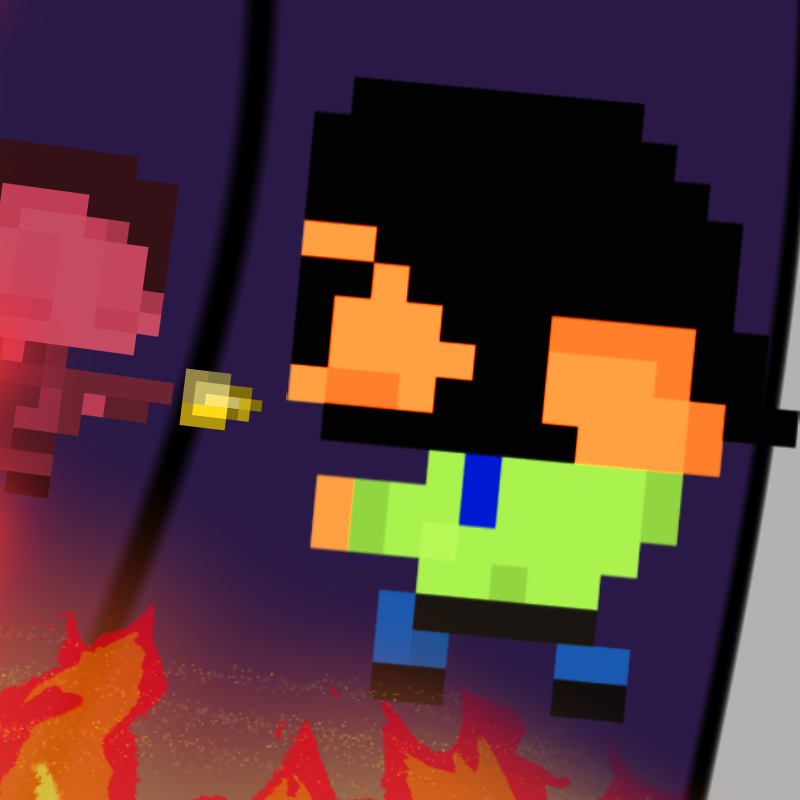

# **NIKO CLIMB**

      
    <small align="center" style="font-weight: 500;">Ascend a burning building while hordes of enemies try to stop you 😱😱</small>

---

## Description
​A fire started on the bottom floor while Timothy was just about to finish work, and for some reason, his co-workers at his low-paying job are trying to kill him??

Ascend the building while clearing out hordes of enemies to get to the next floor. Get as high as you can to escape the flames!

This game is a 2D platformer prototype intended to demonstrate the main gameplay features—keep posted for updates!

## Play the game :)
You can play the prototype for NIKO CLIMB in your browser [here](https://mianjoto.itch.io/niko-climb)!

## Screenshots 📷

## About 📝
This game was made in one month over a short-session Introduction to Game Design and Development course taken in Summer 2022. The game was developed with no prior knowledge of C# or Unity.

## **Concepts learned along development** 🎮
Within the month of development, I learned Unity, C#, and various game development concepts and implementations, including:
- Unity Editor basics
- Unity C# intermediate scripting, inheritance, and composition
- 2D character controller and physics manipulation
- C# Delegate/Event which trigger on major game events
- GameManager, SceneManager, AudioManager singletons
- Handling object sound effects and music persistence
- Player and enemy animations managed by finite state machines
- Coroutine-based player death animation
- Enemy AI behavior tree
- Original character, enemy, and level sprites using Aseprite
- Character animation spritesheets using Aseprite
- Main menu, pause menu, and audio option menu
- UI plan, layout+spacing, and update
- Random level generation
- Player shield system
- Unlock door and regenerate shield floating powerups

## Results 🏆
The prototype for NIKO CLIMB earned a 95% as the final project for the course.

## Tools used 🛠
+ Developed in Unity version 2021.3.1f1
+ Art made in [Aseprite](https://www.aseprite.org/)
+ Imported assets used:
    + [DOTween](http://dotween.demigiant.com/getstarted.php) (tweening asset)
    + [Momcake](https://www.dafont.com/momcake.font) (Main menu and HUD font)
    + [Bit 5x3](https://www.mattlag.com/bitfonts/) (Level number font)

## Download this repository 🌐
1. Install the following requirements:
    + [Unity version 2021.3.1f1](https://unity3d.com/unity/qa/lts-releases)
    + [Microsoft .NET Framework 4.8](https://dotnet.microsoft.com/en-us/download/dotnet-framework/net48)
2. Clone the repository locally:

    ``git clone https://github.com/mianjoto/NIKO-CLIMB-PROTOTYPE.git``

3. Open the project using **Unity 2021.3.1f1** and begin coding :)

## Contact me 📧
This game was conceptualized and developed by undergraduate game developer [Miguel Jover](https://github.com/mianjoto). If you'd like to contact me, please contact me here :)
+ Miguel Jover - [mianjoto@gmail.com](mailto:mianjoto@gmail.com)
